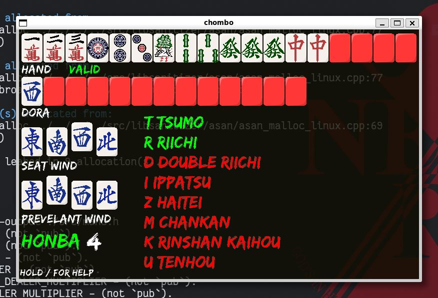
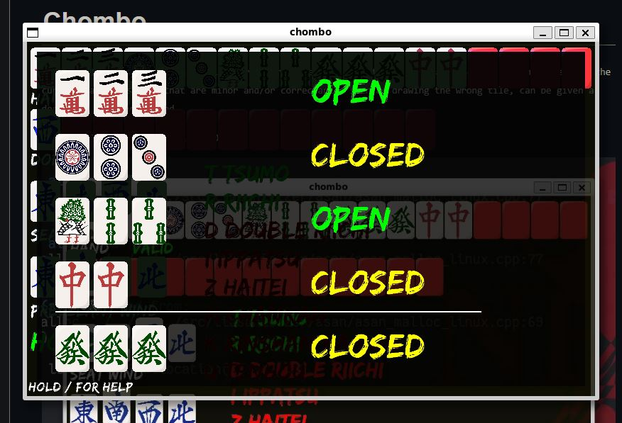
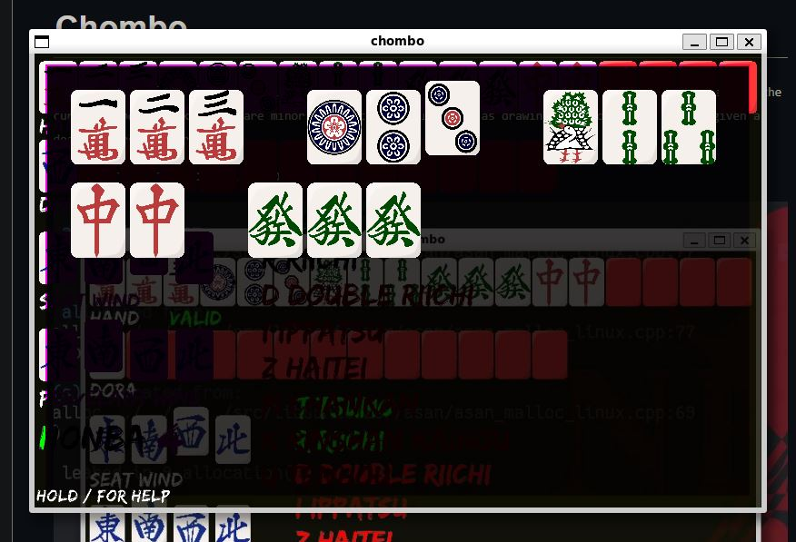
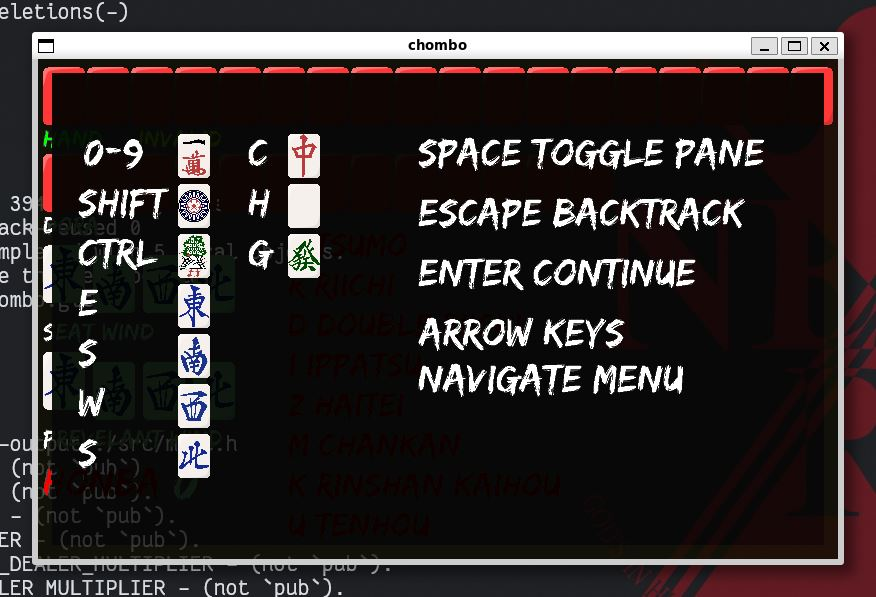

# Chombo 
`Chombo 「錯和/チョンボ」is a penalty for severe game rule violations, generally severe enough to restart the current hand. 
Mistakes that are minor and/or correctable, such as drawing the wrong tile, can be given a dead hand penalty instead.`

Gui riichi mahjong calculator. In progress

<details><summary>example 1</summary>  </details>
<details><summary>example 2</summary>  </details>
<details><summary>example 3</summary>  </details>
<details><summary>example 4</summary>  </details>

#### Requirements for deving
- sdl3
- sdl3ttf
- cbindgen (for generating header files for mahc)
```
make debug && ./main.out
```


#### TODO
- [x] shift -+ window resizing
- [x] figure out why memory leak :(
- [x] help menu 
- [ ] fix for resize bug. (not updating immediatly) 
- [x] input and deleting tile preview on top
- [x] settings round conditions menu
- [x] remove the dastardly typedefs on structs (i was told this will make me a good programmer)
- [x] refactor out that disgustingly repeated adding tile logic in `event.c`
- [ ] move points of text to `L_letter.c`? since none of em move
- [ ] some way to do normalized pointsize for text 
- [ ] some kinda way to indicate the steps to make backtracking less confusing (maybe layers stacked?)
- [ ] using mahc for calculate
- [ ] displaying output
- [ ] figure out how to use cmake to add sdl3 and sdl3ttf as vendored 
- [ ] figure out creating platform specific executable


This project uses
[riichi-mahjong-tiles](https://github.com/FluffyStuff/riichi-mahjong-tiles)
by [FluffyStuff](https://github.com/FluffyStuff) in
[public domain/CC0 1.0 Universal](https://creativecommons.org/publicdomain/zero/1.0/).
